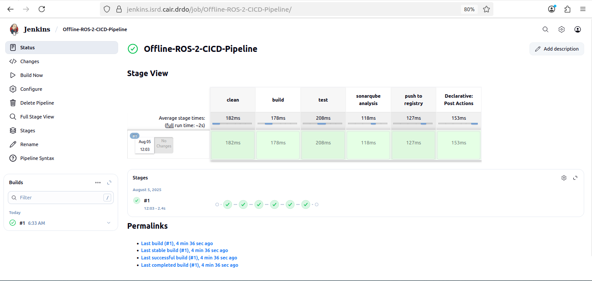
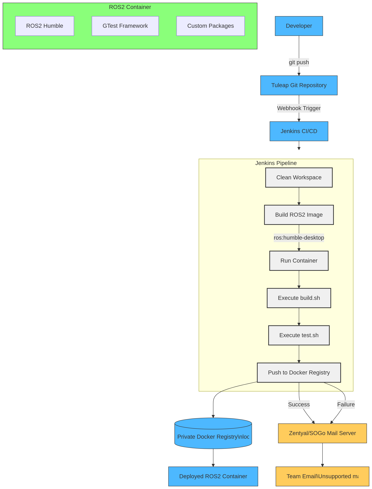

# 🚀 Offline ROS2 CI/CD Automation with Tuleap & Jenkins (Docker-Based)

This project implements a **fully offline CI/CD pipeline** for **ROS2 development**, using containerized tools like **Tuleap**, **Jenkins**, and **NGINX**. The complete setup is designed for **air-gapped environments**, allowing robotic software teams to manage, build, test, and deploy ROS2 code without internet access.

---

## 📊 Architecture Overview

The following diagrams illustrate the end-to-end workflow:

### 🔧 ROS2 CI/CD Pipeline


### 🔄 Jenkins ↔ Tuleap Integration


---

## 🛠️ Technologies Used

- 🐳 **Docker** — Containerization for all components
- 📌 **Tuleap CE** — Project & issue tracking (self-hosted)
- 🔧 **Jenkins LTS** — CI/CD build automation
- 🤖 **ROS2 Humble** — Robotic application codebase
- 🔐 **NGINX** — Reverse proxy with internal TLS
- 📦 **Offline Docker Registry** — Host/pull/push Docker images locally
- 🧾 **Self-signed CA** — Internal HTTPS certificate trust

---

## 📦 Using the Offline Docker Registry

To store and use images in a fully offline setup:

### 🧱 1. Run Registry

```bash
docker run -d \
  --name registry \
  -p 5000:5000 \
  -v /data/docker-registry:/var/lib/registry \
  registry:2


#🏷️ 2. Tag Images

docker tag tuleap/tuleap-community-edition:latest localhost:5000/tuleap
docker tag jenkins/jenkins:lts-jdk17 localhost:5000/jenkins
docker tag osrf/ros:humble-desktop localhost:5000/ros


#🚀 3. Push to Registry
docker push localhost:5000/tuleap
docker push localhost:5000/jenkins
docker push localhost:5000/ros


#📂 Project Structure
.
├── tuleap/                    # Tuleap Docker setup & configs
├── jenkins/                   # Jenkins Docker setup & plugins
├── ros/                       # ROS2 workspace in Docker
├── nginx/                     # HTTPS reverse proxy for Jenkins & Tuleap
├── registry/                  # Offline Docker Registry setup
├── docker-compose.yml         # Orchestration file
├── *.tar                      # Pre-saved Docker images
├── ROS-CICD-Pipeline.png      # Architecture diagram
├── Jenkins-CICD-Workflow.png  # Jenkins-Tuleap flow
└── README.md


#🚀 Getting Started

#1. Load Images (offline-safe)
docker load -i tuleap.tar
docker load -i jenkins.tar
docker load -i ros.tar
docker load -i nginx.tar
docker load -i registry.tar


#2. Start All Containers
docker compose up -d


#3. Access Services
| Service  | URL                                                                     |
| -------- | ----------------------------------------------------------------------- |
| Tuleap   | [https://tuleap.isrd.cair.drdo](https://tuleap.example.com)          |
| Jenkins  | [https://jenkins.isrd.cair.drdo](https://jenkins.example.com)        |
| Registry | [http://localhost:5000/v2/\_catalog](http://localhost:5000/v2/_catalog) |


#✨ Features
📴 100% offline CI/CD workflow

🔐 Internal HTTPS across services

📦 Dockerized Tuleap, Jenkins, ROS2, Registry

🔁 Jenkins pipeline integration with Tuleap

📈 Optional monitoring with Prometheus & Grafana

🔧 Easily portable using .tar images


## 🔗 Connect with Me

- 💼 [LinkedIn](https://linkedin.com/in/maheshbabu-devops)
- 🛠️ [GitHub](https://github.com/MaheshBabu-DevOps)


#✅ This project demonstrates secure, modular CI/CD automation for ROS2 development inside disconnected, containerized infrastructure — ideal for defense labs, research institutes, and enterprise robotics.
